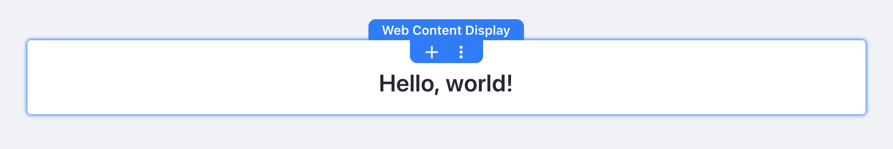

# Widget Ctrl Lite

A themelet providing widget controls styling coming from [Minium Theme](https://github.com/liferay/com-liferay-commerce/blob/7.1.x/commerce-theme-minium/commerce-theme-minium/static-version/src/styles/overrides/_portlet.scss) brought by [Liferay Commerce](https://dev.liferay.com/en/web/commerce/documentation).



## Install

Go to your theme's root folder and type:
```bash
gulp extend
```
Choose _Themelet_ :
```
? What kind of theme asset would you like to extend? 
  Base theme 
❯ Themelet 
```
Choose _Search npm registry_ :
```
? Where would you like to search for themelets? 
  Search globally installed npm modules (development purposes only) 
❯ Search npm registry (published modules) 
```
Search for _widget-ctrl-lite-themelet_ :
```
? Search npm for themelets: widget-ctrl-lite
```
> If you have an error, try `npm audit fix` and retry installation from the beginning 

Press space to select it :
```
? Select a themelet 
❯◉ widget-ctrl-lite-themelet
```

# Licence

[LGPL-2.1](LICENCE)
